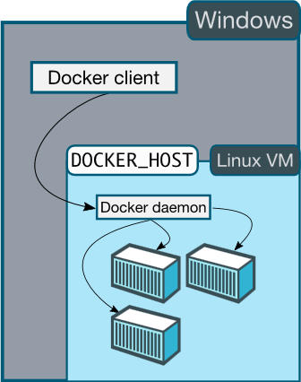

# Windows
> **注意:**
> Docker已经在Windows 7和8.1上测试通过；在低版本Windows上也能运行。
> 不过需要你的处理器支持硬件虚拟化。

Docker引擎使用的Linux内核特性，所以在Windows上运行，我们需要使用一个轻量级
的虚拟机。你可以使用**Windows Docker Client**控制虚拟化Docker引擎，来编译，运行和管理Docker容器。

为了简化这个过程，我们设计了一个叫[Boot2Docker](https://github.com/boot2docker/boot2docker)的帮助应用
来在Windows上创建Linux虚拟机，以便在Linux操作系统上运行Docker。

尽管你使用的是Windows上的Docker客户端，包含容器的docker引擎依然运行在Linux上。现在你只能在Windows机器
上启动Linux容器，除非Windows上的docker引擎开发完成。

## 示范

<iframe width="640" height="480" src="//www.youtube.com/embed/TjMU3bDX4vo?rel=0" frameborder="0" allowfullscreen></iframe>
（译者注：示例在youtube上，此处观看需翻墙。地址：www.youtube.com/embed/TjMU3bDX4vo?rel=0）

## 安装

1. 下载[Docker for Windows Installer](https://github.com/boot2docker/windows-installer/releases/latest)的最新版本（译者注：下载需翻墙）。
2. 运行安装程序，会安装Windows Docker客户端，VirtualBox，Git for Windows (MSYS-git)，boot2docker的Linux镜像和Boot2Docker管理工具。
   
3. 从你的桌面快捷方式或者“程序文件→Boot2Docker for Windows”运行**Boot2Docker Start**。
	启动脚本会要求你输入一个ssh密钥密码-最简单的(但至少安全)是直接点击[Enter]继续。
4. 为了管理在虚拟机中运行的Docker，**Boot2Docker Start**会启动一个已经配置好的unix shell。
	执行 `docker version` 查看是否运行正常：

## 运行 Docker
{{ include "no-remote-sudo.md" }}

为了使你能立即使用上Docker,运行**Boot2Docker Start**会自动启动一个已经配置好环境变量的shell：

让我们试一下 `hello-world` 示例镜像。运行

    $ docker run hello-world

这会下载一个非常小的 `hello-world` 镜像并输出`Hello from Docker.`消息。

## 从Windows命令提示符窗口使用Docker (cmd.exe)

启动一个Windows命令提示符窗口 (cmd.exe)。

Boot2Docker命令要求在PATH内配置`ssh.exe`路径，因此我们通过运行下面的命令，将需要的Git
安装文件夹内的`bin`目录（有ssh.exe）添加到`％PATH％`环境变量：

    set PATH=%PATH%;"c:\Program Files (x86)\Git\bin"

然后我们可以运行 `boot2docker start` 命令来启动Boot2Docker虚拟机。
(如果你遇到错误提示没有虚拟机，运行`boot2docker init`命令初始化虚拟机。)
然后复制cmd.exe命令提示设置你的控制台窗口环境变量,接着你就可以运行docker命令了，如`docker ps`:
（译者注：Windows7上给的提示是export，改成set）

## 从PowerShell使用Docker

启动一个PowerShell窗口，添加`ssh.exe`到你的路径：

    $Env:Path = "${Env:Path};c:\Program Files (x86)\Git\bin"

在你运行`boot2docker start`命令后会打印PowerShell命令，这些命令会完成环境变量的设置
以便连接虚拟机内运行的Docker。在运行这些命令后，你可以运行docker命令了，如`docker ps`:
（译者注：Windows7上给的提示是export，改成set）

> 注意: 你可以运行`boot2docker shellinit | Invoke-Expression`命令设置环境变量
> 而不用在PowerShell中复制、粘帖。

# 更多详情

Boot2Docker管理工具提供了一些命令：

    $ boot2docker
    Usage: boot2docker.exe [<options>] {help|init|up|ssh|save|down|poweroff|reset|restart|config|status|info|ip|shellinit|delete|download|upgrade|version} [<args>]

## 升级

1. 下载 [Docker for Windows Installer](https://github.com/boot2docker/windows-installer/releases/latest)的最新版本（译者注：下载需翻墙）。
2. 运行安装程序，会自动更新Boot2Docker管理工具。
3. 要升级现有的虚拟机上，打开一个终端，运行：

        boot2docker stop
        boot2docker download
        boot2docker start

## 容器端口重定向

如果你需要知道，boot2docker的默认用户是`docker`密码是`tcuser`。
`boot2docker`最新版本仅设置了一个主机网络适配器，它提供了访问容器的端口。

如果你以指定端口运行容器:

    docker run --rm -i -t -p 80:80 nginx

然后你应该能使用你指定的端口访问nginx服务器：

    boot2docker ip

通常,IP地址是192.168.59.103,但它可能会因为Virtualbox的DHCP分配改变。

如需进一步信息或报告问题,请访问[Boot2Docker网站](http://boot2docker.io)

## 使用PUTTY而不是CMD登录

Boot2Docker会在你的`% USERPROFILE % \ . ssh`目录生成和使用公钥/私钥对，
所以为了登录你同样需要使用这个目录的私钥。

私钥需要转换成PuTTY使用的格式。

你可以使用[puttygen](http://www.chiark.greenend.org.uk/~sgtatham/putty/download.html)完成转换:

- 打开`puttygen.exe`并从`%USERPROFILE%\.ssh\id_boot2docker`目录加载 ("File"->"Load" menu)私钥
- 接着点击："Save Private Key".
- 最后用保存的文件PuTTY登录`docker@127.0.0.1:2022`。

## 卸载

你可以使用Windows标准卸载方式卸载Boot2Docker。但这种方式不会删除 `docker-install.exe` 文件，
你必须手动删除此文件。

## 参考资料

如果你想运行Docker但你不想使用Boot2Docker安装，你可以使用非官方的
Windows包管理Chocolately安装docker.exe。更多信息请参考[Docker package on Chocolatey](http://chocolatey.org/packages/docker).