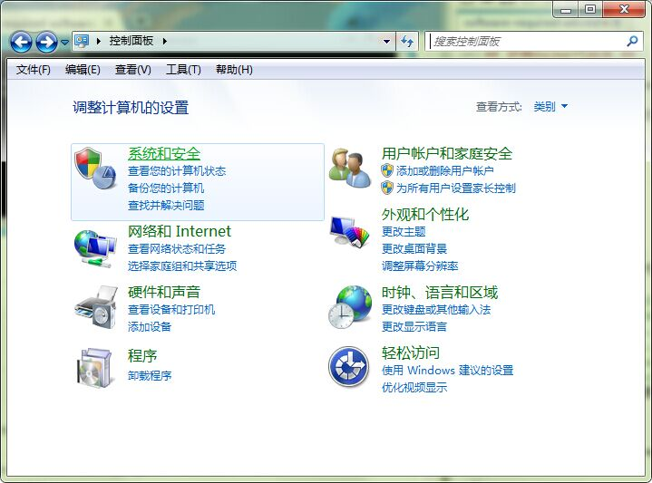
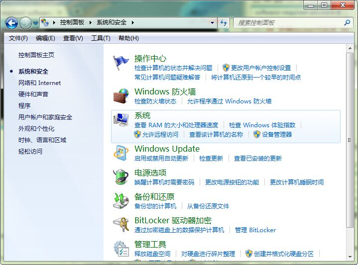
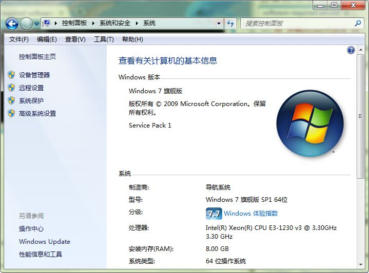
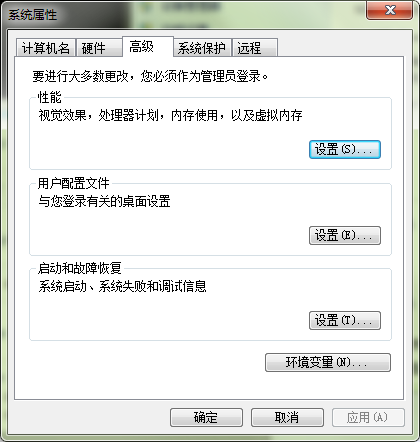

# 在Windows上获取必要软件 #

本文直白讲诉使用Window Server 2012 或者windows 8的电脑需要怎样获取Docker开发的软件。在此之前，你必须具备如下条件：

* GitHub账号
* Git for Windows (msysGit)
* TDM-GCC, a compiler suite for Windows
* MinGW (tar and xz)
* Go language

> 说明：安装程序会安装到C盘，如果你的系统的主活动磁盘在D盘，你将需要在特定时候选择替换为D盘。

## 获得Github账号 ##

为了能贡献Docker项目，你需要有[Github账号](https://github.com/)。当然账号是免费的(:。所有Docker项目的库都是公有的，对任何人可见。

你需要有使用Github应用和在命令行上使用git的经验。

## Windows上安装git ##

Git for Windows包含几个工具，msysGit（构建环境）. 环境中包含你需要用于开发的工具：Gi和Git Bash shell。

1. 访问[Git for Windows](https://msysgit.github.io/)下载页面.
1. 点击**下载**，浏览器会提示你保存文件到你的系统中.
1. 运行保存的文件，此时系统会显示**Git安装向导**。
1. 点击**下一步**，所有向导页都选择默认值。
1. 点击**完成**。

## 安装TDM-GCC ##

TDM-GCC是Windows平台编译套件。 你将使用它编译Docker Go代码。

- 浏览器访问[tdm-gcc download page](http://tdm-gcc.tdragon.net/download)。
- 点击下载最新的64位软件包，浏览器会提示你保存文件到你系统中。
- 运行保存的文件，此时系统会显示**TDM-GCC安装向导**。
- 点击**创建**。
- 点击**下一步**，所有向导页都选择默认值。
- 点击**完成**。

## 安装MinGW (tar and xz) ##
MinGW是一个简化版GNU Compiler Collection (GCC)。 当然,你需要首次下载和安装**MinGW安装助手**。然后使用助手安装tar 和xz工具。

1. 浏览器访问 [MinGW SourceForge](http://sourceforge.net/projects/mingw/)。

2. 点击下载，浏览器会提示你保存文件到你系统中。

3. 运行下载的文件。

系统会打开**MinGW安装助手**。

1. 选择**安装**MinGW安装助手。

2. 点击**继续**，系统会打开**MinGW安装助手**。

3. 点击**继续**，在打开**MinGW安装助手**安装完成后。

4. 选择 **All Packages > MSYS Base System** 从左边的菜单中，系统会显示所有有效的软件包。

5. 点击**msys-tar bin**，选择**Mark for Installation**。

6. 点击**msys-xz bin** 选择**Mark for Installation**。

7. 选择**Installation > Apply Changes**,安装选中的包。

系统会显示**Schedule of Pending Actions Dialog**。

8. 点击**应用**，MingGW为你安装所有包。

9. 关闭**对话框**和**MinGW安装助手**。

## 安装Go并交叉编译它 ##

安装Go语言并编译源码，以此让它可以交叉编译linux/amd64 架构的东西。

1. 浏览器打开[Go语言下载](http://golang.org/dl/)。

2. 找到并下载最新的.msi安装软件，浏览器会提示你保存文件到你系统中。

3. Run安装软件，系统会打开**Go编程语言安装向导**。

4. 选择默认设置安装。

5. 点击关闭安装向导。

6. 打开命令行。

7. 切换到Go的src路径下：

		cd c:\Go\src
8. 设置如下Go环境变量。

		c:\Go\src> set GOOS=linux
		c:\Go\src> set GOARCH=amd64
9. 编译源码。

		c:\Go\src> make.bat

编译源码的过程也会往系统加入一些环境变量。

## 获得Docker代码库 ##

启动Git bash终端获得Docker源码，从Github上。

1. 查找Git Bash程序并启动它。

2. 切换到root路径下。

		$ cd /c/
3. 创建gopath目录。

		$ mkdir gopath
4. Go获得docker/docker代码库。

		$ go.exe get github.com/docker/docker package github.com/docker/docker
		imports github.com/docker/docker
		imports github.com/docker/docker: no buildable Go source files in C:\gopath\src\github.com\docker\docker
接下来，你为你的Go路径创建环境变量。

5. 打开**控制面板**。

6. 选择**系统与安全**> **系统**.

7. 点击**高级系统设置**。

系统会打开**系统属性对话框**。

8. 选择**高级**页签，点击环境变量。

9. 系统会打开**环境变量对话框**。

10. 找到**系统变量(S)**，滚动滚动体找到**Path**变量。

11. 点击**新建**，现在你会创建某些新的环境变量。

12. 键入**GOPATH**作为**变量名**。
键入如下值，作为**变量值**：
		C:\gopath;C:\gopath\src\github.com\docker\docker\vendor
13. 点击**确定**，关闭对话框。系统就添加了GOPATH到系统环境变量中。

14. 点击**确定**，关闭剩余的对话框。

## 下一步 ##

[配置Git](set-up-git.md)