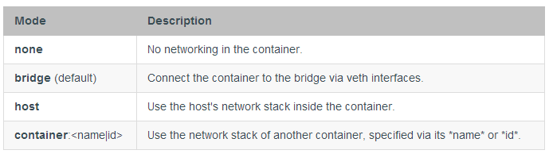
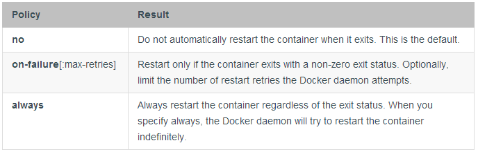
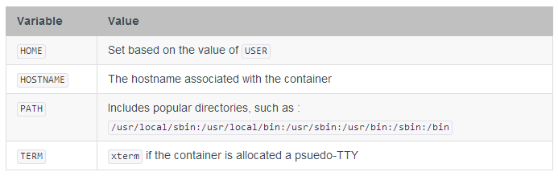

# Docker 运行参考

当操作者执行docker run时，Docker运行进程在分离的容器中，它应用子身份文件系统，网络和独立的进程树，开始一个进程。启动进程的镜像可能会定义与此bin命令相关的默认的运行程序，暴露的网络或者其他更多。但是docker run 把决定权给予了启动容器的用户。这就是为什么此命令比其他命令有更多选项的原因。

 

## 通用形式

基本的docker run命令如下形式:

	$ sudo docker run [OPTIONS] IMAGE[:TAG] [COMMAND] [ARG...]

如何理解[OPTIONS]的类型，可参考Option types.

[OPTIONS]可以分成两类：

1. 设置用户专用项，包括：

- 分离或者前台运行
- 容器识别
- 网络设置
- 运行时cpu和内存限制
- 特权和lxc配置

2. 用户和开发者共享设置，用户可以重写开发者在构建时期的配置。

两者一起为用户提供了运行时完全控制，运行用户复写一切构建时期的开发者设置和docker 运行时的默认设置。

## 用户专用设置项

只有用户（执行docker run的人）可以设置一下的选项:

- 分离VS前台Detached vs Foreground
	- 分离Detached (-d)
	- 前台Foreground
- 容器识别Container Identification
	- 命名Name (--name)
	- PID环境PID Equivalent
- IPC设置IPC Settings
- 网络设置Network Settings
- 重启策略RestartPolicies(--restart)
- 清理Clean Up (--rm)
- 运行时CPU和内存限制Runtime Constraints on CPU and Memory
-  特权和lxc配置Runtime Privilege, Linux Capabilities, and LXC Configuration

 

## 分离VS前台

当启动docker容器时，必须首先决定是否想以“分离模式”在后台运行这个容器或者或者以默认的前台方式运行：

	-d=false: Detached mode: Run container in the background, print new container id

 

### 分离（-d）

在分离模式中（-d=true或者就-d），所有的I/O应该通过网络或者共享卷完成，因为容器将不再监听执行docker run的命令行。可以使用attach命令重新关连。如果选择以分离模式运行则不可以使用--rm选项。

 

### 前台

在前台模式（不使用-d的默认模式），docker  run可以启动进程，关联控制台和进程的标准输入输出流及标准错误。甚至可充当TTY（这是大多数命令行可执行程序所期望的），传递信号。而且所有这些均是可配置的：

	-a=[]           : Attach to `STDIN`, `STDOUT` and/or `STDERR`
	-t=false        : Allocate a pseudo-tty
	--sig-proxy=true: Proxify all received signal to the process (non-TTY mode only)
	-i=false        : Keep STDIN open even if not attached

如果不使用-a，docker会关联所有的标准流。如下，可以指定想关联三种标准的流的那个：

	$ sudo docker run -a stdin -a stdout -i -t ubuntu /bin/bash

对于交互进程（如shell），为给容器分配tty，必须同时使用-i-t。然而当客户端的标准输出流是重定向了或者是管道时不能指定-t，比如：echo test|docker run -i busybox cat。

 

## 容器标定

### Name（--name）

用户可以用三中方式标定一个容器：

- UUID l长整形标识符 ("f78375b1c487e03c9438c729345e54db9d20cfa2ac1fc3494b6eb60872e74778")
- UUID 短整型标识符  ("f78375b1c487")
- 命名 ("evil_ptolemy")

UUID标示符来自于Docker后台进程，如果不分配名字，后台进程会随机产生一个名字。这个名字将会成为给容器赋予意义的可取方式，因为可以使用名字定义links（或者其他需要标志容器的任何地方）。对于前台和后台docker容器都可以采用这样的方式。

 

### PID等价物

最后，可以自动的将容器ID到所选的文件的。这和某些程序将它们的进程ID写进文件是相似的：

	--cidfile="": Write the container ID to the file

 

### Image[:tag]

当没有严格标一个容器时，可以标定以Image[:tag]标定你将要运行容器的镜像例如，docker run ubuntu:14.04。

 
### Image[@digest]
Images using the v2 or later image format have a content-addressable identifier called a digest. As long as the input used to generate the image is unchanged, the digest value is predictable and referenceable.
 

## PID设置（--pid）

	--pid=""  : Set the PID (Process) Namespace mode for the container,
       'host': use the host's PID namespace inside the container

默认所有容器都有PID命名空间。

PID命名空间提供了进程隔离。PID命名矿建移除系统的进程视图，允许进程ID，包括PID 1，可以复用。

某种情况下，需要容器和主机共享命名空间，基本需要容器内的进程感知系统的所有进程。例如，你可以建立一个拥有strace 或者gdb这样的调试工具的容器，但是想在调试容器内进程时使用这工具.

	$ sudo docker run --pid=host rhel7 strace -p 1234

此命令将允许用户在主机中追踪容器内PID1234的进程。

 

## ipc设置(--ipc)

	--ipc=""  : Set the IPC mode for the container,                             'container:<name|id>': reuses another container's IPC namespace
	
	                             'host': use the host's IPC namespace inside the container

IPC（POSIX/SysV IPC）命名空间提供命名共享内存段，信号量和消息队列的隔离。

命名共享内存段用作在内存的速度级上加速进程间通信，而不是使用管道或者网络堆栈。共享内存经常用在数据库和用户自建的（通常是c/openMPI，c++/使用boost库）用于科学计算和财政服务行业的高性能应用。如果这些应用被分在多个容器中则需要使用IPC机制。

 

## 网络配置

	--dns=[]         : Set custom dns servers for the container
	--net="bridge"   : Set the Network mode for the container
	                    'bridge': creates a new network stack for the container on the docker bridge
	                    'none': no networking for this container
	                    'container:<name|id>': reuses another container network stack
	                    'host': use the host network stack inside the container
	--add-host=""    : Add a line to /etc/hosts (host:IP)
	--mac-address="" : Sets the container's Ethernet device's MAC address

所有容器默认开启网络，可以与外部连接。用户可以完全用docker run --net none禁用网络，这可以禁用所有网络出入的连接。这种情况下，可以通过文件或者标准输入输出进行IO操作。

容器将使用主机作为默认的DNS服务器，但是可以用--dns覆盖。

默认mac地址是随机产生的。可以用--mac-address(f格式 12:34:56:78:9a:bc)明确设置mac地址。

所支持网络模式有：

### None-无网络

Bridge-通过虚拟以太网接口连接网络

Host-使用主机的网络堆栈。注意：这会使容器完全访问主机系统服务比如D-bus，因此被认为是安全的。

Container-使用其他容器 的网络堆栈。

### Mode：none

设置成none时，容器将不会访问外部路由。容器仅有容器内部的loopback接口，但是没有任何外网路由。

### Mode：bridge

设置成bridge时，容器使用docker默认的网络设置。桥是在主机建立的，通常叫docker0，其为容器建立一对以太网接口。一个接口连接主机的桥，另一个接口连接容器的loopback接口。Docker会为容器分配IP地址，流量通过桥路由至容器。

### Mode：host

设置成host时容器共享主机的网络堆栈，主机的所有接口可以被容器所用。容器的主机名会匹配主机的主机名。共享主机网络堆栈时发布端口和对其他容器的链接都会不起作用。

### Mode：container

设置成container时容器会共享网络堆栈的另一个容器的网络配置；其他容器的名字以--net container:<name|id>.的格式提供。

Example运行一个带有Redis监听localhost的Redis容器，运行redis-cli命令在本机接口中链接Redis服务器。

	$ sudo docker run -d --name redis example/redis --bind 127.0.0.1
	$ # use the redis container's network stack to access localhost
	$ sudo docker run --rm -it --net container:redis example/redis-cli -h 127.0.0.1

 

## 管理/etc/hosts

容器的/etc/hosts中含有定义容器和localhost主机名的行以及其他基础配置。--add-host标签可以向/etc/hosts添加额外的行。

	$ sudo docker run -it --add-host db-static:86.75.30.9 ubuntu cat /etc/hosts
	172.17.0.22     09d03f76bf2c
	fe00::0         ip6-localnet
	ff00::0         ip6-mcastprefix
	ff02::1         ip6-allnodes
	ff02::2         ip6-allrouters
	127.0.0.1       localhost
	::1             localhost ip6-localhost ip6-loopback
	86.75.30.9      db-static

 

## 重启策略（--restart）

使用--restart标签可以指定重启策略，配置容器重启和退出时的行为。

如果重启策略生效则使用docker ps 时可以看见Up 或者 Restarting。也可以使用 docker events查看生效的重启策略。

Docker支持如下重启策略：

 重启前的延迟会不断增加(倍增前一次延迟，初始100毫秒)以避免洪泛。这意味着后台进程会等待100毫秒，然后200毫秒，400毫秒，800,1600直到on-failure限制，或者停止或移除容器。

如果容器成功重启（启动并运行至少10秒）延迟将重新变为100毫秒。

使用on-failure 时可以指定最大尝试次数默认docker会一直尝试重启。尝试次数可以通过 docker inspect获取。比如，获取“my-container”的重启次数：

	$ sudo docker inspect -f "{{ .RestartCount }}" my-container

	# 2

或者，获取上次重启时间：

	$ docker inspect -f "{{ .State.StartedAt }}" my-container

	# 2015-03-04T23:47:07.691840179Z

不可以同时设置"clean up (--rm)"和重启策略，否则报错。

例子

	$ sudo docker run --restart=always redis

这会使容器redis如果存在则一直重启。

	$ sudo docker run --restart=on-failure:10 redis

这会使容器以带有on-failur限制10的重启策略运行.如果redis容器有超过10次的非零退出标识，将会不再重启。最大重启数限制仅在on-failure策略有效。

 

## clear up（-rm）

默认，容器的文件系统在容器存在后就存在。这会使调试更加容易（因为可以坚持最终状态）并且可以默认保留所有的数据。但是如果运行一个短期的前台进程，容器的文件系统会累积。除非让docker自动清理容器，当容器退出时移除文件系统，可以通过--rm标签实现：

	--rm=false: Automatically remove the container when it exits (incompatible with -d)

 

## 安全配置

	--security-opt="label:user:USER"   : Set the label user for the container
	--security-opt="label:role:ROLE"   : Set the label role for the container
	--security-opt="label:type:TYPE"   : Set the label type for the container
	--security-opt="label:level:LEVEL" : Set the label level for the container
	--security-opt="label:disable"     : Turn off label confinement for the container
	--security-opt="apparmor:PROFILE"  : Set the apparmor profile to be applied 
	                                     to the container

用--security-opt 标签可以覆盖容器默认的标签scheme。例如，可以为MCS系统指定指定MCS/MLS等级。下面的命令中指定等级允许容器间共享内容。

	# docker run --security-opt label:level:s0:c100,c200 -i -t fedora bash

MLS例子如下：

	# docker run --security-opt label:level:TopSecret -i -t rhel7 bash

禁止容器以--permissive运行时安全标记使用下面的命令：

	# docker run --security-opt label:disable -i -t fedora bash

如果需要为容器内的进程使用更加严格的安全策略，可以为容器指定可选的类型。可以运行一个仅仅监听Apache端口的容器，如下：

# docker run --security-opt label:type:svirt_apache_t -i -t centos bash

> 注意：必须编写定义svirt_apache_t类型的策略。

 

 

## 运行时CPU和内存限制

此操作可以调整容器的性能参数。

	-m="": Memory limit (format: <number><optional unit>, where unit = b, k, m or g)
	-memory-swap="": Total memory limit (memory + swap, format: <number><optional unit>, where unit = b, k, m or g)
	-c, --cpu-shares=0         CPU shares (relative weight)

用户可用docker run -m选限制容器可用的内存。如果主机支持交换内存-m设置可以比实际物理内存大。

###　内存约束

有四种方式设置内存使用：

memory=L<inf, memory-swap=inf (指定内存并设置内存交换为-1) 不允许使用超过L byte 的内存，但是可用无限 的内存交换(如果主机支持).

memory=L<inf, memory-swap=2L (指定内存而不指定内存交换) I不能超过L byte的内存，和2L的内存交换。

memory=L<inf, memory-swap=S<inf, L<=S (同时指定内存和内存交换) I不允许使用超过L byte 的内存和S的内存交换。

类似地，用户可以用-c选项提升容器的优先级。默认所有容器的优先级是相同的，获取相同比例的CPU周期，但是可以在容器启动时，让内核给予更多的周期份额。

-c或者 --cpu-shares标记值为0表示运行的容器可以访问所有的1024CPU份额，然而这个值可以修改，以使容器以不同优先级或者不同CPU份额运行。

例如，如果{C0, C1，C2}以(-c  --cpu-shares = 0) and  {C3} 以 (-c o或者--cpu-shares=512)启动，则C0, C1，C2拥有100%CPU份额(1024)，C3有50%份额(512)。时间量子为100毫秒的时间片操作系统的环境中，C0, C1，C2将会全量子运行，C3则是半量子运行，即50毫秒。
	
	PID    container    CPU CPU share
	100    {C0}     0   100% of CPU0
	101    {C1}     1   100% of CPU1
	102    {C1}     2   100% of CPU2

 

## 运行时特权，linux能力及LXC配置

	--cap-add: Add Linux capabilities
	--cap-drop: Drop Linux capabilities
	--privileged=false: Give extended privileges to this container
	--device=[]: Allows you to run devices inside the container without the --privileged flag.
	--lxc-conf=[]: Add custom lxc options

Docker容器默认无特权，不能，如在容器内启动一个docker后台进程。因为容器默认不能访问所有设备，但是”特权“容器可以访问所有设备(参考lxc-template.go 和文档cgroups devices).。

用户执行docker run --privileged时，docker会允许访问主机的所有设备以及AppArmor 或SELinux的所有配置，以允许容器可以几乎像外部进程一样访问主机。Docker Blog中可以获取更多--privileged的信息。

如果需要限制设备或特殊设备的访问可以使用--device标签。可以指定容器可以访问一或多个设备。

	$ sudo docker run --device=/dev/snd:/dev/snd ...

默认容器可以在设备中read, write, 和 mknod，可以以--device覆盖默认配置，赋予它个人rwm权限。

    $ sudo docker run --device=/dev/sda:/dev/xvdc --rm -it ubuntu fdisk  /dev/xvdc    Command (m for help): q    $ sudo docker run --device=/dev/sda:/dev/xvdc:r --rm -it ubuntu fdisk  /dev/xvdc    You will not be able to write the partition table.    Command (m for help): q    $ sudo docker run --device=/dev/sda:/dev/xvdc:w --rm -it ubuntu fdisk  /dev/xvdc        crash....    $ sudo docker run --device=/dev/sda:/dev/xvdc:m --rm -it ubuntu fdisk  /dev/xvdc    fdisk: unable to open /dev/xvdc: Operation not permitted

附加--privileged，用户可以很好用--cap-add 和--cap-drop控制容器的能力。默认docker具有一系列能力。两个标签都支持值all，所有用户需要除了MKNOD之外的所有能力可以这样做：

	$ sudo docker run --cap-add=ALL --cap-drop=MKNOD ...

为了与网络堆栈交互，可以使用--cap-add=NET_ADMIN 代替--privileged 去修改网络接口。

	$ docker run -t -i --rm  ubuntu:14.04 ip link add dummy0 type dummy
	RTNETLINK answers: Operation not permitted
	$ docker run -t -i --rm --cap-add=NET_ADMIN ubuntu:14.04 ip link add dummy0 type dummy

如需加载基于FUSE的文件系统，可以同时使用--cap-add 和--device:

	$ docker run --rm -it --cap-add SYS_ADMIN sshfs sshfs sven@10.10.10.20:/home/sven /mnt
	fuse: failed to open /dev/fuse: Operation not permitted
	$ docker run --rm -it --device /dev/fuse sshfs sshfs sven@10.10.10.20:/home/sven /mnt
	fusermount: mount failed: Operation not permitted
	$ docker run --rm -it --cap-add SYS_ADMIN --device /dev/fuse sshfs
	# sshfs sven@10.10.10.20:/home/sven /mnt
	The authenticity of host '10.10.10.20 (10.10.10.20)' can't be established.
	ECDSA key fingerprint is 25:34:85:75:25:b0:17:46:05:19:04:93:b5:dd:5f:c6.
	Are you sure you want to continue connecting (yes/no)? yes
	sven@10.10.10.20's password:
	root@30aa0cfaf1b5:/# ls -la /mnt/src/docker
	total 1516
	drwxrwxr-x 1 1000 1000   4096 Dec  4 06:08 .
	drwxrwxr-x 1 1000 1000   4096 Dec  4 11:46 ..
	-rw-rw-r-- 1 1000 1000     16 Oct  8 00:09 .dockerignore
	-rwxrwxr-x 1 1000 1000    464 Oct  8 00:09 .drone.yml
	drwxrwxr-x 1 1000 1000   4096 Dec  4 06:11 .git
	-rw-rw-r-- 1 1000 1000    461 Dec  4 06:08 .gitignore
	....

如果docker后台进程使用LXC 执行驱动启动(docker -d --exec-driver=lxc)则用户可以以一个或多个--lxc-conf参数指定 LXC选项。这些参数可能是新的或者覆盖了lxc-template.go中已经存在的参数。注意，将来主机的后台进程可能不会使用LXC，所以这是一个专为熟悉LXC的用户提供的配置。

> 注意：如果使用--lxc-conf修改同时也被docker后台进程管理的容器配置，那后台进程将不会感知修改，必须自己解决任何冲突。比如，使用--lxc-conf设置容器的IP地址，但是这不会反映到/etc/hosts文件。

## 覆盖默认的dockerfile镜像

开发者从dockerfile建立镜像时或者提交时，开发者可以设置一些默认的参数，这些参数会展镜像启动时生效。

Dockerfile的四个命令不能再运行时被覆盖：FROM, MAINTAINER, RUN, 和 ADD。其他的都能在docker run时相应覆盖。下面将介绍开发者可能设置的dockerfile指令，以及用户如何覆盖。

- CMD (默认命令或者选项)
- ENTRYPOINT (运行时默认执行的命令)
- EXPOSE (外来连接端口)
- ENV (环境变量)
- VOLUME (共享文件系统)
- USER
- WORKDIR

## CMD (默认命令或者选项)

在docker命令行，调用可选的COMMAND：

	$ sudo docker run [OPTIONS] IMAGE[:TAG] [COMMAND] [ARG...]

这个命令是可选的因为建立IMAGE的人可能已经用CMD指令提供了默认的COMMAND。用户（使用容器着）可以用新COMMAND覆盖CDM指令。

如果镜像指定了ENTRYPOINT，则CMD 或 COMMAND会被当做参数添加至ENTRYPOINT。

## 入口点（运行时默认执行的命令）

	--entrypoint="": Overwrite the default entrypoint set by the image

镜像的entrypoint和COMAND相似因为其指定容器启动时运行什么，但是复写（有意地）更加困难。ENTRYPOINT指明容器默认的行为，因此当使用ENTRYPOINT时运行容器时，由于完全是默认行为，会使人觉得它本身就是这个二进制程序，还可以通过COMMAND传递更多选项。但是有时用户可能需要在容器内启动其他程序，这是可以在运行时用一串字符指定新的ENTRYPOINT以复写ENTRYPOINT。下面是一个如何在默认启动/usr/bin/redis-server的容器中启动shell的例子：

	$ sudo docker run -i -t --entrypoint /bin/bash example/redis

或者两个如何向入口点传递更多参数的例子：

	$ sudo docker run -i -t --entrypoint /bin/bash example/redis -c ls -l
	$ sudo docker run -i -t --entrypoint /usr/bin/redis-cli example/redis --help

 

3# 暴露（外来连接端口）

Dockerfile不会控制网络太多，仅仅提供EXPOSE指令给用户一个外来连接端口应该提供什么服务的提示。下面的选项可以配置或复写dockerfile的默认设置。

	--expose=[]: Expose a port or a range of ports from the container
	            without publishing it to your host
	-P=false   : Publish all exposed ports to the host interfaces
	-p=[]      : Publish a container᾿s port or a range of ports to the host 
	               format: ip:hostPort:containerPort | ip::containerPort | hostPort:containerPort | containerPort
	               Both hostPort and containerPort can be specified as a range of ports. 
	               When specifying ranges for both, the number of container ports in the range must match the number of host ports in the range. (e.g., `-p 1234-1236:1234-1236/tcp`)
	               (use 'docker port' to see the actual mapping)
	--link=""  : Add link to another container (<name or id>:alias)

如前所述，EXPOSE (和 --expose)为外来连接提供端口。容器内的端口号（服务监听处）不辞与主机端口号（客户端连接处）一样，因此容器内部需要在80端口监听HTTP服务，而外部连接可能在42800端口。

为使新容器到达服务器容器开发者或用户暴露的内部端口，用户有三种选择：以-P，-p或--link启动容器。

如用P，-p启动则docker会使暴露的端口在主机可以访问，在客户端到达主机时可用。使用——P时docker会绑定暴露端口到49153 至 65535的一个随机的端口。

如用--link则会启动新的客户端容器，然后客户端容器可通过私有网络接口访问暴露端口。Docker会在客户端容器设置环境参数以指明那个端口被使用。

 

## ENV (环境变量)

当新容器被创建时，docker将设置自动下面的环境变量：

容器可能还包含由于连接到其他容器的环境变量，详情参见Container Links。

另外，用户可以通过一个或多个-e标签设置环境变量，甚至覆盖上表设置，或者开发者定义的设置：

	$ sudo docker run -e "deep=purple" --rm ubuntu /bin/bash -c export
	declare -x HOME="/"
	declare -x HOSTNAME="85bc26a0e200"
	declare -x OLDPWD
	declare -x PATH="/usr/local/sbin:/usr/local/bin:/usr/sbin:/usr/bin:/sbin:/bin"
	declare -x PWD="/"
	declare -x SHLVL="1"
	declare -x container="lxc"
	declare -x deep="purple"

类似，用户可以用-h设置主机名。

--link <name or id>:alias也可设置环境变量，使用别名定义提供IP 和PORT信息的环境变量。假设已经有一个运行Redis 的容器：

	# Start the service container, named redis-name
	$ sudo docker run -d --name redis-name dockerfiles/redis
	4241164edf6f5aca5b0e9e4c9eccd899b0b8080c64c0cd26efe02166c73208f3
	
	# The redis-name container exposed port 6379
	$ sudo docker ps
	CONTAINER ID        IMAGE                        COMMAND                CREATED             STATUS              PORTS               NAMES
	4241164edf6f        $ dockerfiles/redis:latest   /redis-stable/src/re   5 seconds ago       Up 4 seconds        6379/tcp            redis-name
	
	# Note that there are no public ports exposed since we didn᾿t use -p or -P
	$ sudo docker port 4241164edf6f 6379
	2014/01/25 00:55:38 Error: No public port '6379' published for 4241164edf6f

还可以获取Redis容器以--link暴露的端口信息。选择一个可以成为环境变量的别名！

	$ sudo docker run --rm --link redis-name:redis_alias --entrypoint /bin/bash dockerfiles/redis -c export
	declare -x HOME="/"
	declare -x HOSTNAME="acda7f7b1cdc"
	declare -x OLDPWD
	declare -x PATH="/usr/local/sbin:/usr/local/bin:/usr/sbin:/usr/bin:/sbin:/bin"
	declare -x PWD="/"
	declare -x REDIS_ALIAS_NAME="/distracted_wright/redis"
	declare -x REDIS_ALIAS_PORT="tcp://172.17.0.32:6379"
	declare -x REDIS_ALIAS_PORT_6379_TCP="tcp://172.17.0.32:6379"
	declare -x REDIS_ALIAS_PORT_6379_TCP_ADDR="172.17.0.32"
	declare -x REDIS_ALIAS_PORT_6379_TCP_PORT="6379"
	declare -x REDIS_ALIAS_PORT_6379_TCP_PROTO="tcp"
	declare -x SHLVL="1"
	declare -x container="lxc"

可以使用这些信息作为客户端与另一容器连接：

	$ sudo docker run -i -t --rm --link redis-name:redis_alias --entrypoint /bin/bash dockerfiles/redis -c '/redis-stable/src/redis-cli -h $REDIS_ALIAS_PORT_6379_TCP_ADDR -p $REDIS_ALIAS_PORT_6379_TCP_PORT'
	172.17.0.32:6379>

Docker将通过在/etc/hosts写入行，以映射私有地址至被链接的容器的别名。可以使用这种机制通过别名和一个链接容器通信。

	$ sudo docker run -d --name servicename busybox sleep 30
	$ sudo docker run -i -t --link servicename:servicealias busybox ping -c 1 servicealias

如果重启源容器（此例中是servicename），接收容器的/etc/hosts键会自动更新。

注意：不像/etc/hosts文件的键一样，保存在环境变量的IP地址不会自动更新，如果原容器重启。推荐使用/etc/hosts的主机的键解析链接容器的IP地址。

 

## 卷（共享文件系统）

	-v=[]: Create a bind mount with: [host-dir]:[container-dir]:[rw|ro].
	       If "container-dir" is missing, then docker creates a new volume.
	--volumes-from="": Mount all volumes from the given container(s)

卷命令很复杂在Managing data in containers中有专门的文档。开发者给镜像可以定义一或多卷，但是仅用户可以给予从一个容器到另一容器的访问权。

 

## 用户

容器默认的用户是root（id=0）但是开发者如果额外创建了用户，这些用户也可以被访问。开发者可以设置默认的用户，以USER指令运行第一个程序，但是用户可以复写：

	-u="": Username or UID

注意：如果传递数字型UID，其范围为0-2147483647。

 

## 工作目录

默认的程序运行的工作目录是根目录（/），开发者可以用WORKDIR命令设置不同发目录。用户可以复写：

	-w="": Working directory inside the container